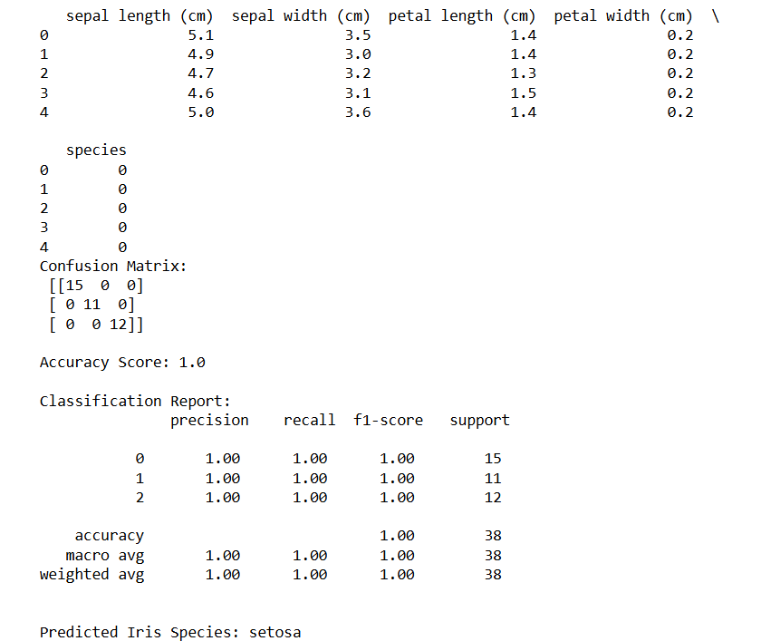

# SGD-Classifier
## AIM:
To write a program to predict the type of species of the Iris flower using the SGD Classifier.

## Equipments Required:
1. Hardware – PCs
2. Anaconda – Python 3.7 Installation / Jupyter notebook

## Algorithm
1) Start by Importing the Necessary libraries. 
2) Import and Load the Data. 
3) Split Dataset into Training and Testing Sets. 
4) Train the Model Using Stochastic Gradient Descent (SGD). 
5) Make Predictions and Evaluate Accuracy. 
6) Generate Confusion Matrix. 
7) Stop.

## Program:
```
/*
Program to implement the prediction of iris species using SGD Classifier.
Developed by: B Prabhanjan
RegisterNumber:  212225040305
*/
```
```

# Import required libraries
import pandas as pd
from sklearn.datasets import load_iris
from sklearn.model_selection import train_test_split
from sklearn.preprocessing import StandardScaler
from sklearn.linear_model import SGDClassifier
from sklearn.metrics import confusion_matrix, accuracy_score, classification_report

# ------------------------------
# Step 1: Load Iris dataset
# ------------------------------
iris = load_iris()

# Create DataFrame
df = pd.DataFrame(iris.data, columns=iris.feature_names)

# Target column
df['species'] = iris.target

print(df.head())

# ------------------------------
# Step 2: Split into features and target
# ------------------------------
X = df.drop('species', axis=1)
y = df['species']

# ------------------------------
# Step 3: Train-test split
# ------------------------------
X_train, X_test, y_train, y_test = train_test_split(
    X, y, test_size=0.25, random_state=42
)

# ------------------------------
# Step 4: Feature scaling
# ------------------------------
scaler = StandardScaler()

X_train = scaler.fit_transform(X_train)
X_test = scaler.transform(X_test)

# ------------------------------
# Step 5: Create and train SGD Classifier
# ------------------------------
sgd_model = SGDClassifier(
    loss='log_loss',   # Logistic Regression using SGD
    max_iter=1000,
    learning_rate='optimal',
    random_state=42
)

sgd_model.fit(X_train, y_train)

# ------------------------------
# Step 6: Make predictions
# ------------------------------
y_pred = sgd_model.predict(X_test)

# ------------------------------
# Step 7: Evaluate the model
# ------------------------------
print("Confusion Matrix:\n", confusion_matrix(y_test, y_pred))

print("\nAccuracy Score:", accuracy_score(y_test, y_pred))

print("\nClassification Report:\n",
      classification_report(y_test, y_pred))

# ------------------------------
# Step 8: Predict species for a new flower
# ------------------------------
# Example values:
# sepal length, sepal width, petal length, petal width

new_flower = [[5.1, 3.5, 1.4, 0.2]]

new_flower_scaled = scaler.transform(new_flower)

species_pred = sgd_model.predict(new_flower_scaled)

# Convert numeric class to species name
species_name = iris.target_names[species_pred[0]]

print("\nPredicted Iris Species:", species_name)
 
```


## Output:



## Result:
Thus, the program to implement the prediction of the Iris species using SGD Classifier is written and verified using Python programming.
